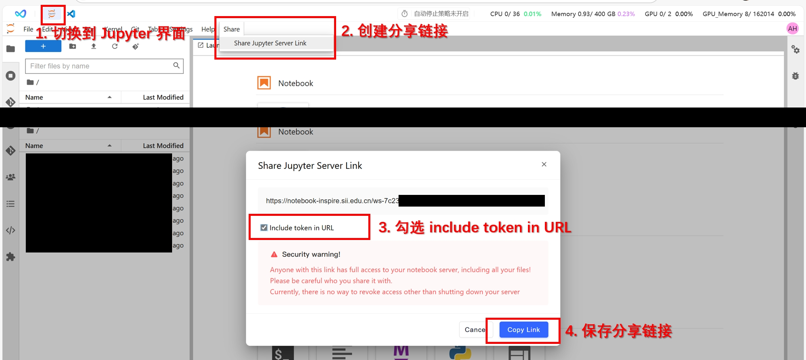

# 夏令营具身智能题目提交说明

## 获取测评实例分享链接

我们所有的测评都将在启智云平台进行，请按照本文档创建你用于测评的云平台实例分享链接。请参照 [README: CHECKLIST](./README.md#5-checklist) 部分检查你的实例是否满足要求。

通过下图所示方式获取到 Jupyter 分享链接。



请妥善保管你的 Jupyter 分享链接，通过该链接将可以访问并操作你的实例。


## 填写问卷

助教将会在实训截止前发布问卷链接，请按照要求填写问卷。每组只需填写一份问卷，问卷截至之前可以修改问卷内容。

## 提交实训材料

实训截止前会发布实训材料提交要求，请按要求提交实训材料。

如果要求提交源代码，你可以通过以下指令获取压缩包文件提交。

```bash
bash submit.sh 文件名
```

该指令会将源码文件打包到 `文件名.tar.gz`。

